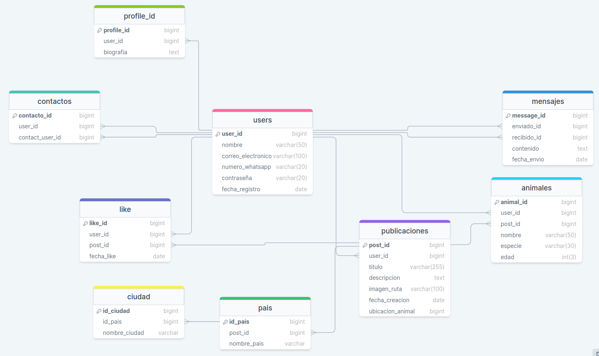

# ZooSmart

ZooSmart es una plataforma en línea diseñada para conectar a personas interesadas en la adopción de animales y facilitar el proceso de búsqueda y contacto entre adoptantes y dueños de mascotas.

En ZooSmart, los usuarios pueden registrarse y crear perfiles donde pueden subir fotos y detalles de animales disponibles para adopción, se incluye el estado del animal y los requisitos que la persona interesada en adoptar debe cumplir. Los usuarios también pueden interactuar con las publicaciones de otros usuarios, expresando interés mediante la función de "me gusta".

Cuando un usuario da "me gusta" a una publicación, se habilita la opción de contacto con el dueño de la mascota. Esto permite establecer comunicación directa entre ambos, facilitando la coordinación y negociación de la adopción.

ZooSmart es un espacio seguro y amigable donde los amantes de los animales pueden encontrar compañeros peludos en busca de un hogar amoroso. Además, fomenta la interacción entre usuarios para compartir consejos, experiencias y promover el bienestar animal.

## Características

- Registro de usuarios y creación de perfiles.
- Subida de fotos y detalles de animales para adopción.
- Interacción mediante la función de "me gusta" en las publicaciones.
- Habilitación de contacto entre usuarios que han dado "me gusta" a una publicación.

## Tecnologías utilizadas

- Lenguajes: JavaScript
- Backend: Node.js, Express.js
- Base de datos: MySQL
- Otras tecnologías y bibliotecas relevantes

## Requisitos Previos

- Node.js instalado en el entorno local.
- Base de datos MySQL configurada y accesible.

## Licencia

- Este proyecto está bajo la Licencia LTS.

## Contacto

- Para cualquier pregunta o consulta, no dudes en contactarme al siguiente correo: lvillamizarmurillo@gmail.com

## Tablas

1. Tabla de usuarios:

   - Relacionada con la tabla de publicaciones y la tabla de me gusta mediante el ID de usuario.
   - Cada usuario puede tener múltiples publicaciones y recibir múltiples me gusta.
   - Puede tener una relación con la tabla de mensajes para permitir la comunicación entre usuarios.

2. Tabla de publicaciones:

   - Relacionada con la tabla de usuarios mediante el ID de usuario.
   - Cada publicación pertenece a un usuario específico.
   - Puede tener una relación con la tabla de me gusta para registrar los me gusta recibidos.

3. Tabla de me gusta:

   - Relacionada con la tabla de usuarios y la tabla de publicaciones mediante el ID de usuario y el ID de publicación.
   - Registra qué usuarios han dado me gusta a qué publicaciones.

4. Tabla de mensajes:

   - Relacionada con la tabla de usuarios mediante el ID de remitente y el ID de destinatario.
   - Almacena los mensajes enviados entre usuarios.

5. Tabla de contactos:

   - Relacionada con la tabla de usuarios mediante el ID de usuario y el ID de usuario de contacto.
   - Permite a los usuarios guardar y mantener una lista de contactos.

6. Tabla de contactos:

   - Relacionada con la tabla de usuarios mediante el ID de usuario y el ID de usuario de contacto.
   - Permite a los usuarios guardar y mantener una lista de contactos.

7. Imagen de referencia:

   )

## Meta

- El viernes 21 de julio tener adelantado la base de datos hecha completamente, el server montado con express y ya tener algunos endpoints totalmente funcionales, donde se realicen varias consultas básicas en la base de datos, tanto de ingreso, consulta, actualizacion de datos.