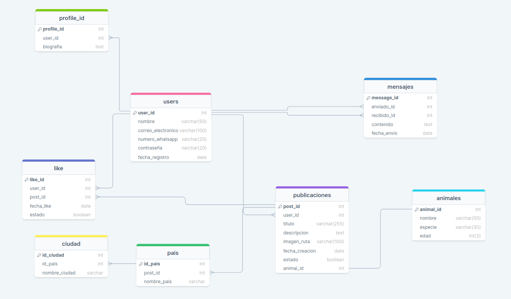

# ZooSmart

ZooSmart es una plataforma en línea diseñada para conectar a personas interesadas en la adopción de animales y facilitar el proceso de búsqueda y contacto entre adoptantes y dueños de mascotas.

En ZooSmart, los usuarios pueden registrarse y crear perfiles donde pueden subir fotos y detalles de animales disponibles para adopción, se incluye el estado del animal y los requisitos que la persona interesada en adoptar debe cumplir. Los usuarios también pueden interactuar con las publicaciones de otros usuarios, expresando interés mediante la función de "me gusta".

Cuando un usuario da "me gusta" a una publicación, se habilita la opción de contacto con el dueño de la mascota. Esto permite establecer comunicación directa entre ambos, facilitando la coordinación y negociación de la adopción.

ZooSmart es un espacio seguro y amigable donde los amantes de los animales pueden encontrar compañeros peludos en busca de un hogar amoroso. Además, fomenta la interacción entre usuarios para compartir consejos, experiencias y promover el bienestar animal.

## Características

- Registro de usuarios y creación de perfiles.
- Subida de fotos y detalles de animales para adopción.
- Interacción mediante la función de "me gusta" en las publicaciones.
- Habilitación de contacto entre usuarios que han dado "me gusta" a una publicación.

## Tecnologías utilizadas

- Node.js como plataforma de ejecución.
- Express.js para la creación del servidor web.
- MySQL como base de datos relacional.
- TypeScript para un desarrollo más estructurado.
- class-transformer y class-validator para la validación y transformación de datos.
- reflect-metadata
- dotenv para la gestión de variables de entorno.
- nodemon para reiniciar automáticamente el servidor en desarrollo.
- mysql2
- jose, libreria esencial para crear los JWT.

## Dependencias que se usaron

Se usó la `v18.16.1` de NojeJS para este proyecto

1. Clone este repositorio en su máquina local.
2. Se pueden descargar las dependencias con el comando:

```
npm i -E -D nodemon express dotenv class-transformer reflect-metadata class-validator typescript mysql2 jose express-session
```

Se instala `nodemon` para que se reinicie el servidor cada vez que se haga un cambio en el código *Se instala nodemon en las dependecias de desarrollo* Se instala `express` para crear el servidor Se instala `dotenv` para cargar las variables de entorno Se instala `mysql2` para la conexión con la base de datos Se instala `jose` para la creacion de token Se instala `typescript` para el uso de typescript Se instala `class-transformer` para transformar los datos que se envían al servidor Se instala `class-validator` para validar los datos que se envían al servidor, es necesario el reflect-metadat y el jose para generar los tokens 4. Configuración del archivo .env Escribe el puerto que vayas a utilizar:

```
CONFIG = { "hostname" : "locahost", "port" : ""}
```

Antes de ejecutar el servidor, asegúrate de llenar los datos del archivo .env con la información de tu base de datos y las claves necesarias. El archivo .env debe tener la siguiente estructura:

```
MY_CONECTION = {"host":"localhost","user":"","password":"","database":"","port":3306}
```

Aparte debes tener la variable de entorno para usar JWT:

```
JWT_PRIVATE_KEY = "djfqoiwrue4reu23rksjd"
```

1. Para correr el servidor se usa el comando:

```
npm run dev
```


- Base de datos MySQL configurada y accesible, para crearla sencillo solo debes entrar a la carpeta db/ZooSmart.sql.
- Luego ejecutar cada código de arriba hacia abajo.

## Uso

Para utilizar el sistema de gestión de incidencias técnicas, primero debe obtener un token de permiso para acceder a los endpoints protegidos. Puede obtenerlo haciendo una solicitud a la siguiente URL:

```
GET http://localhost:port/autorizacion/:tabla?endpoint
```

Reemplace `:tabla` con los datos del usuario que va a utilizar los endpoints(users,publicaciones,animales,like). `RECUERDA` Que el port tienes que haberlo definido en el .env Una vez que tenga el token, inclúyalo en el encabezado de sus solicitudes a los endpoints protegidos utilizando la siguiente clave-valor:

```
Authorization: Bearer tu_token_aqui
```

# Endpoints de ZooSmart

A continuación, puede utilizar los siguientes endpoints para interactuar con el sistema:

### users

1. `GET /autorizacion/users?endpoint`: Obtiene el token de users, dura 1 h, recomendacion guardarlo.


- `GET /users`: Obtener todos los usuarios registrados.

- *`GET /users`:*

  ```
  {
  
  }
  ```

  

- `GET /users/id`: Obtener un usuario en especifico que este registrado unicamente por el id.

- *`GET /users/id`:*

  ```
  {
    "id": 3
  }
  ```

  -Recuerda revisar la URL para antes de realizar el post ya que para  esta función se le agrega /id extra a la URL, las demás no la tienen.

- `POST /users`: Crea un nuevo usuario.

- *`POST /users`:*

  ```
  {
    "id": 123,
    "nombre": "Miguel",
    "email": "campusland@company.com",
    "numero": "1234567890",
    "password": "asddsafs213"
  }
  ```

  

- `PUT /users`: Modifica un  usuario registrado guiándose por el id.

- *`PUT /users`:*

  ```
  {
    "id": 3,
    "nombre": "Santiago",
    "email": "Santiago@company.com",
    "numero": "9876543210",
    "password": "sfhiud$%5"
  }
  ```

  

- `DELETE /users`: Elimina un  usuario registrado guiándose unicamente por el id.

- *`DELETE /users`:*

  ```
  {
    "id": 7
  }
  ```

  

### Publicaciones

`GET /autorizacion/publicaciones?endpoint`: Obtiene el token de publicaciones, dura 1 h, recomendacion guardarlo.


- `GET /publicaciones`: Obtener todas las publicaciones registrados.

- *`GET /publicaciones`:*

  ```
  {
  
  }
  ```

  

- `GET /publicaciones/id`: Obtener una publicación en específico que este registrado unicamente por el id.

- *`GET /publicaciones/id`:*

  ```
  {
    "id": 35
  }
  ```

  -Recuerda revisar la URL para antes de realizar el post ya que para  esta función se le agrega /id extra a la URL, las demás no la tienen.

- `POST /publicaciones`: Crea una nueva publicación.

- *`POST /publicaciones`:*

  ```
  {
    "id": 123,
    "user-id": 10,
    "titulo": "Venezuela",
    "descripcion": "sdfgsdgfsdgsdfgs",
    "imagen_ruta": "http://imagen/ruta90"
  }
  ```

  

- `PUT /publicaciones`: Modifica una publicación, guiándose por el id.

- *`PUT /publicaciones`:*

  ```
  {
    "id": 99,
    "user-id": 9,
    "titulo": "Sapamanga",
    "descripcion": "fghfghfghfgh",
    "imagen_ruta": "http://imagen/ruta100"
  }
  ```

  

### Animales

`GET /autorizacion/animales?endpoint`: Obtiene el token de animales, dura 1 h, recomendacion guardarlo.


- `GET /animales`: Obtener todos los animales registrados.

- *`GET /animales`:*

  ```
  {
  
  }
  ```

  

- `GET /animales/id`: Obtener un usuario en especifico que este registrado unicamente por el id.

- *`GET /animales/id`:*

  ```
  {
    "id": 3
  }
  ```

  -Recuerda revisar la URL para antes de realizar el post ya que para  esta función se le agrega /id extra a la URL, las demás no la tienen.

- `POST /animales`: Crea un nuevo animal.

- *`POST /animales`:*

  ```
  {
    "id": 123,
    "user-id": 8,
    "post-id": 85,
    "nombre": "Pablo",
    "especie": "Pollo",
    "edad": 15
  }
  ```

  

- `PUT /animales`: Modifica un  animal, guiándose por el id.

- *`PUT /animales`:*

  ```
  {
    "id": 2,
    "user-id": 3,
    "post-id":98,
    "nombre": "Gunter",
    "especie": "Pinguino",
    "edad": 6
  }
  ```

  

- `DELETE /animales`: Elimina un  animal registrado guiándose unicamente por el id.

- *`DELETE /animales`:*

  ```
  {
    "id": 10
  }
  ```

  

### Like

`GET /autorizacion/like?endpoint`: Obtiene el token de like, dura 1 h, recomendacion guardarlo.


- `GET /like`: Obtener todos los likes registrados.

- *`GET /like`:*

  ```
  {
  
  }
  ```

  

- `GET /like/id`: Obtener un like en especifico que este registrado, unicamente por el id.

- *`GET /like/id`:*

  ```
  {
    "id": 6
  }
  ```

  -Recuerda revisar la URL para antes de realizar el post ya que para  esta función se le agrega /id extra a la URL, las demás no la tienen.

- `POST /like`: Crea un nuevo like.

- *`POST /like`:*

  ```
  {
    "id": 8,
    "user-id": 1,
    "post-id": 35
  }
  ```

  

- `PUT /like`: Modifica un  animal, guiándose por el id.

- *`PUT /like`:*

  ```
  {
    "id": 3,
    "user-id": 6,
    "post-id":87
  }
  ```

  

## Contacto

- Para cualquier pregunta o consulta, no dudes en contactarme al siguiente correo: lvillamizarmurillo@gmail.com

## Tablas

1. Tabla de usuarios:

   - Relacionada con la tabla de publicaciones y la tabla de me gusta mediante el ID de usuario.
   - Cada usuario puede tener múltiples publicaciones y recibir múltiples me gusta.
   - Puede tener una relación con la tabla de mensajes para permitir la comunicación entre usuarios.

2. Tabla de publicaciones:

   - Relacionada con la tabla de usuarios mediante el ID de usuario.
   - Cada publicación pertenece a un usuario específico.
   - Puede tener una relación con la tabla de me gusta para registrar los me gusta recibidos.

3. Tabla de perfiles de usuarios:

   - Contiene información adicional de los perfiles de los usuarios registrados.
   - profile_id, user_id, información adicional del perfil (ubicación, biografía, etc.).
   - Esta tabla permite a los usuarios proporcionar detalles adicionales sobre sí mismos en sus perfiles.

4. Tabla de me gusta:

   - Relacionada con la tabla de usuarios y la tabla de publicaciones mediante el ID de usuario y el ID de publicación.
   - Registra qué usuarios han dado me gusta a qué publicaciones.

5. Tabla de mensajes:

   - Relacionada con la tabla de usuarios mediante el ID de remitente y el ID de destinatario.
   - Almacena los mensajes enviados entre usuarios.

6. Tabla de contactos:

   - Relacionada con la tabla de usuarios mediante el ID de usuario y el ID de usuario de contacto.
   - Permite a los usuarios guardar y mantener una lista de contactos.

7. Tabla de animales:

   - Descripción: Almacena información específica sobre los animales disponibles para adopción en la plataforma.
   - Columnas sugeridas: animal_id, user_id, nombre del animal, especie, edad, descripción, imagen.
   - Esta tabla proporciona detalles clave sobre cada animal, como nombre, especie, edad y descripción, lo que ayuda a los usuarios a encontrar la mascota adecuada para su adopción.

8. Tabla de países:

   - Descripción: Almacena información sobre los países disponibles en la plataforma.
   - Columnas sugeridas: id_pais (clave primaria), nombre del país.
   - Esta tabla permite a los usuarios seleccionar el país al que pertenece la ubicación del animal en la publicación.

9. Tabla de ciudades:

   - Descripción: Almacena información sobre las ciudades disponibles en la plataforma.
   - Columnas sugeridas: id_ciudad (clave primaria), nombre de la ciudad, id_pais (clave externa que hace referencia a la tabla de países).
   - Esta tabla proporciona una lista de ciudades asociadas a cada país para que los usuarios elijan la ubicación específica del animal en la publicación.

10. Imagen de referencia:

   

## Meta

- El viernes 28 de julio tener adelantado la base de datos hecha completamente, el server montado con express y ya tener algunos endpoints totalmente funcionales, donde se realicen varias consultas básicas en la base de datos, tanto de ingreso, consulta, actualización de datos.